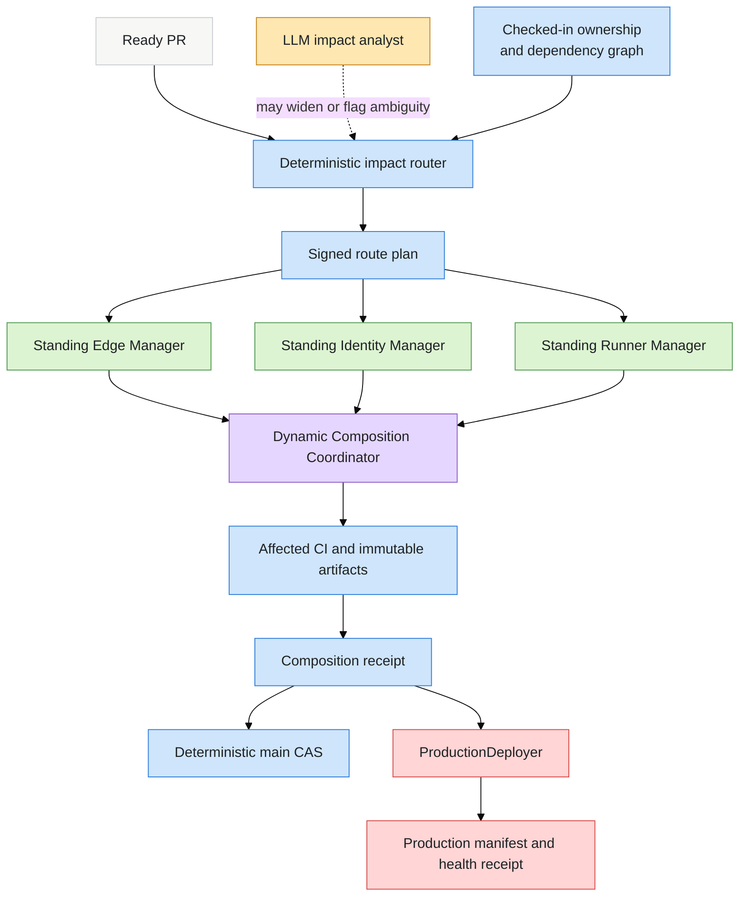
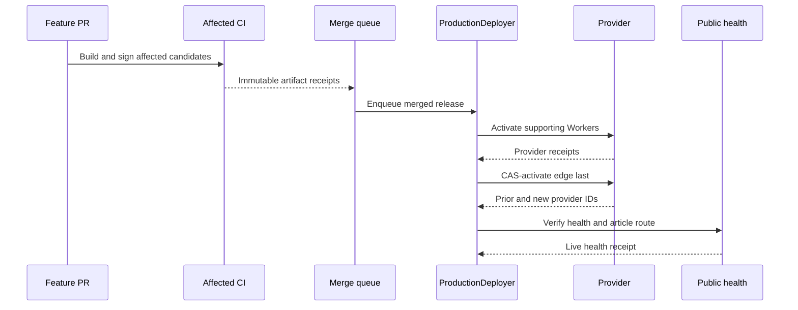
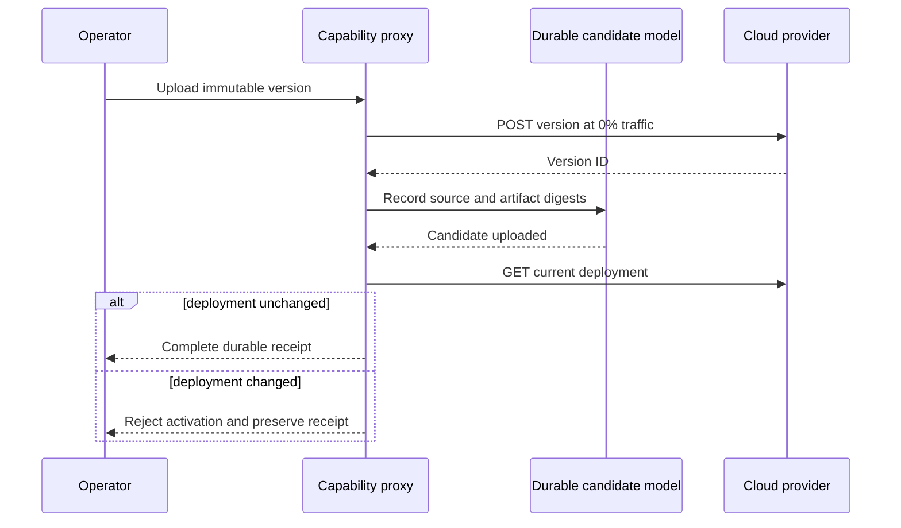
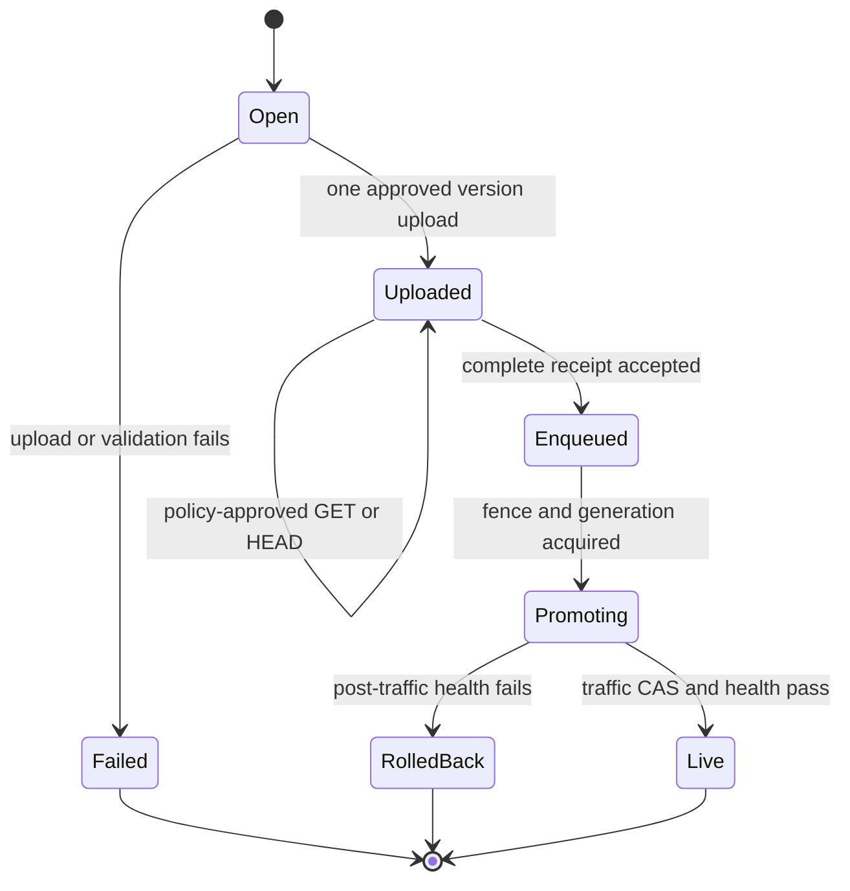
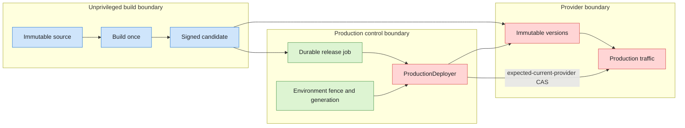
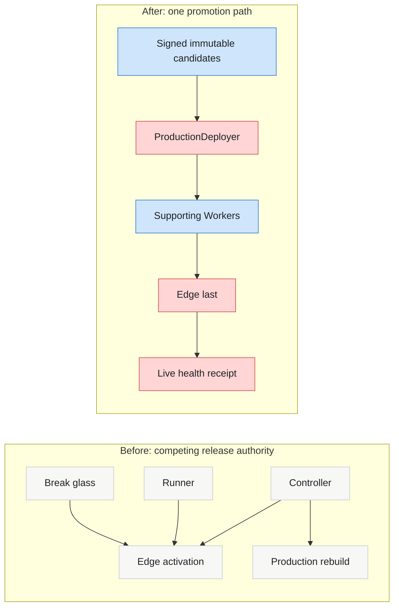

# Blog visual language

Use this reference for article-specific diagrams, generated imagery, hybrid
visuals, and visual review. It records the preferred house style and gives
copyable examples; adapt topology and labels to the article rather than using
the examples as decorative templates.

## Contents

- [Choose the production sequence](#choose-the-production-sequence)
- [Use the house style](#use-the-house-style)
- [Organize before styling](#organize-before-styling)
- [Canonical examples](#canonical-examples)
- [Review the result](#review-the-result)

## Choose the production sequence

Choose by the truth the visual must preserve:

| Article need | Start with | Optional second pass | Final form |
| --- | --- | --- | --- |
| Architecture, authority, ownership, data flow | Deterministic diagram | Image generation for composition or texture studies | SVG, HTML, Mermaid, or deterministic overlay |
| Sequence, state, incident, migration | Deterministic diagram | Usually none | Timeline, swimlane, sequence, or state diagram |
| Measurements or evidence | Source data or authentic screenshot | Never use generated pixels as evidence | Chart, table, annotated screenshot, or diff |
| Editorial metaphor, atmosphere, hero, or social card | Image generation | Add exact type or branding deterministically | Generated or composited image |
| Technical concept that should feel editorial | Exact diagram | Image generation from the diagram as art direction | Verified hybrid with exact labels restored |

Use this default order:

1. State the exact question the visual must answer.
2. If labels, topology, scale, chronology, or evidence carry the answer, make the
   deterministic visual first. Use `visualize:visualize` for an in-conversation
   study when useful; build the publishable result in site-native code.
3. If mood, metaphor, or publication identity carries the answer, begin with
   `imagegen` studies.
4. For a hybrid, give the deterministic source to image generation, choose a
   visual direction, then restore exact labels, topology, scales, and evidence
   in a deterministic layer.
5. Compare the final output against the source of truth at rendered size.

## Use the house style

Prefer semantic pastel technical diagrams:

- top-down reading order for authority and delivery flows;
- left-to-right reading order for time, sequence, and before/after comparison;
- one dominant path, with branches and exceptions visually subordinate;
- generous whitespace, short centered labels, dark readable text, thin borders,
  and restrained curved connectors;
- color assigned by role, never by box identity;
- containers only for real ownership, trust, runtime, or phase boundaries;
- labeled arrows when the relationship or transition is not obvious;
- minimal crossings; change layout or add lanes before accepting tangled edges;
- no gradients, decorative shadows, oversized titles, dashboard chrome, or a
  rainbow of peer nodes.

Use this semantic palette as the default starting point:

| Meaning | Fill | Border | Typical use |
| --- | --- | --- | --- |
| Neutral input/context | `#F7F7F5` | `#C9CDD2` | PR, user, external context |
| Deterministic control/data | `#CFE5FB` | `#2F7ED8` | routers, plans, artifacts, receipts |
| Standing owner/executor | `#DDF4D2` | `#4F9A51` | managers, workers, services |
| Analysis/ambiguity | `#FFE7B2` | `#C88419` | LLM input, review, uncertainty |
| Coordination/composition | `#E5D6FF` | `#8B5CC7` | coordinators, joins, fan-in |
| Production mutation/outcome | `#FFD5D5` | `#D84B4B` | deployer, traffic, rollback, live result |
| Text and connectors | none | `#5E646B` | arrows and structural lines |

Color must remain redundant with labels, position, line style, or shape. Adapt
tokens to the destination theme and verify contrast rather than preserving a
hex value that becomes inaccessible.

## Organize before styling

Pick the smallest organization that answers the question:

- **Flowchart:** one-way authority, ownership, or transformation pipeline.
- **Swimlanes:** handoffs among actors or systems over time. This is the default
  for release, incident, and operational stories.
- **Sequence:** exact request/response order, including retries or rejection.
- **State machine:** legal states and transition events; omit implementation
  components unless they cause a transition.
- **System boundaries:** ownership, trust, credential, runtime, or network
  separation. Nest only real boundaries.
- **Before/after:** architectural simplification or changed responsibility. Use
  matched alignment so readers can compare without hunting.

If a diagram needs more than roughly twelve visible nodes, first split it into
an overview and one detail figure. Keep a stable reading axis across both.

## Canonical examples

These are source examples, not screenshots. Preserve their organizational
grammar and semantic color roles while replacing the content with article facts.

### Authority flowchart

Use for a deterministic control path with optional analysis and explicit
production authority.

### Release swimlanes

Use for operational handoffs. Align all actors to one time axis and show the
traffic mutation as the last privileged action.

### Protocol sequence with rejection

Use when ordering and validation are the mechanism. Show the unhappy path in
the same figure when it explains the contract.

### Candidate state machine

Use when legal transitions matter more than component ownership.

### System and authority boundaries

Use when the story is about credential ownership or trust separation.

### Before and after

Use matched columns and a single visual thesis. The reader should understand
the simplification before reading every label.

## Review the result

At rendered desktop and mobile sizes, verify:

- the answer is visible without reading the surrounding paragraph;
- the dominant path is visually obvious and follows one axis;
- labels are short, legible, and use one term per concept;
- colors preserve the semantic mapping and remain redundant with other cues;
- connectors do not cross labels or imply false sequence or ownership;
- generated passes did not change factual topology, labels, values, or evidence;
- the caption states the figure's claim or question, not merely its contents;
- meaningful alt text or a textual equivalent carries the same conclusion.
